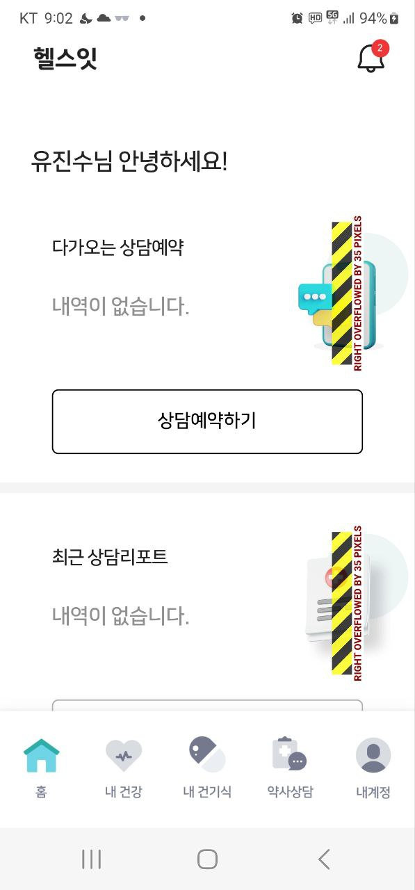
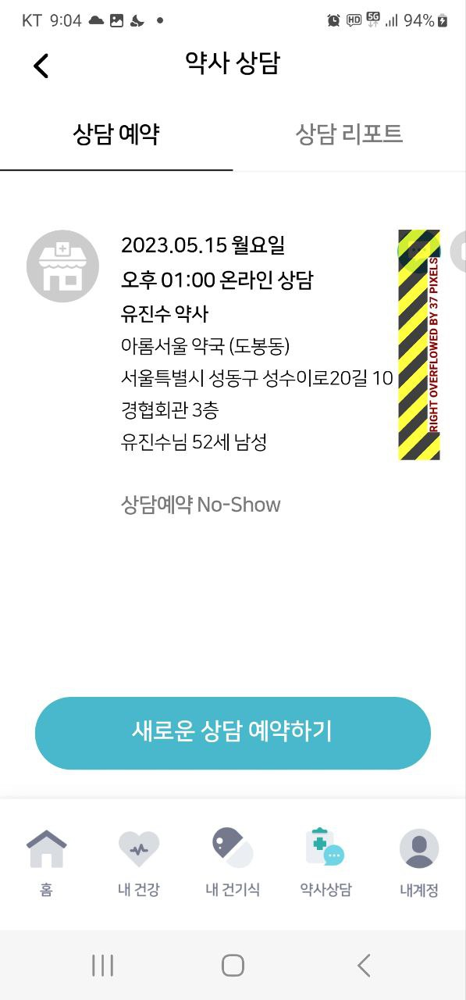

## overflow 에러 화면 수정 실례

개발자 테스트 시에는 발견되지 않는 오류의 사례가 테스터에게서 또는 고객에게서 발생하곤 한다.  
아래에 소개할 2개의 overflow와 관련해서는 회사 대표님이 테스트하다가 발생한 오류를 수정한 결과를 공유한다.
참고로 테스터는 눈이 노안인 관계로 폰의 설정을 아래와 같이 하여 사용하고 있었다.  

| Device                         | 글자 크기와 스타일  | 화면 크게/작게    |
|--------------------------------|-------------|-------------|
| **갤럭시 노트3**                     |          |             |

## 1. 공통 컴포넌트에서 Expand를 사용하지 않아서, overflow가 발생한 경우

[overflow 화면]  


<!--  -->

[수정 전, code]

```dart
...
SizedBox(
            width: width,
            height: height,
            child: image,
        );
...
```

[수정 후, code]  


## 2. 기기의 화면 배율의 변경에 따라, overflow가 발생한 경우

[overflow 화면]

<!--  -->

[수정 전, code]

```dart
..
SizedBox(
    width: 190,
    child: Column(
    crossAxisAlignment: CrossAxisAlignment.start,
...
```

[수정 후, code]


## 3. 모바일용 공통 뷰포트 Size

메타 뷰포트 값 width=device-width를 사용하면 페이지가 기기별 픽셀 단위로 화면 너비와 같도록 할 수 있음.  작은 휴대폰에서 렌더링되든 큰 데스크톱 모니터에서 렌더링되든 다양한 화면 크기에 맞게 콘텐츠를 다시 그릴 수 있게됨.  따라서 기기별 viewport값을
참조하여 UI 코딩시 참조할 수 있도록 함.  

**Apple Devices**  

| Device                         | Pixel Size  | Viewport    |
|--------------------------------|-------------|-------------|
| **iPhone**                     |      -       |      -       |
| iPhone 12 Pro Max              | 2778 x 1284 |  428 x 926  |
| iPhone 12 Pro                  | 2532 x 1170 |  390 x 844  |
| iPhone 12                      | 2532 x 1170 | 414 x 895   |
| iPhone 11                      | 1792 x 828  | 390 x 844   |
| iPhone XR                      | 828 x 1792  | 414 x 896   |
| iPhone XS                      | 1125 x 2436 | 375 x 812   |
| iPhone XS Max                  | 1242 x 2688 | 414 x 896   |
| iPhone X                       | 1125 x 2436 | 375 x 812   |
| iPhone 8 Plus                  | 1080 x 1920 | 414 x 736   |
| iPhone 8                       | 750 x 1334  | 375 x 667   |
| iPhone 7 Plus                  | 1080 x 1920 | 414 x 736   |
| iPhone 7                       | 750 x 1334  | 375 x 667   |
| iPhone 6 Plus/6S Plus          | 1080 x 1920 | 414 x 736   |
| iPhone 6/6S                    | 750 x 1334  | 375 x 667   |
| iPhone 5                       | 640 x 1136  | 320 x 568   |
| iPod                           |             |             |
| iPod Touch                     | 640 x 1136  | 320 x 568   |
| iPad                           |             |             |
| iPad Pro                       | 2048 x 2732 | 1024 x 1366 |
| iPad Third & Fourth Generation | 1536 x 2048 | 768 x 1024  |
| iPad Air 1 & 2                 | 1536 x 2048 | 768 x 1024  |
| iPad Mini 2 & 3                | 1536 x 2048 | 768 x 1024  |
| iPad Mini                      | 768 x 1024  | 768 x 1024  |

**Android Devices**  

| Device                 | Pixel Size  | Viewport   |
|------------------------|-------------|------------|
| Android Phone          |             |            |
| Nexus 6P               | 1440 x 2560 | 412 x 732  |
| Nexus 5X               | 1080 x 1920 | 412 x 732  |
| Google Pixel 3 XL      | 1440 x 2960 | 412 x 847  |
| Google Pixel 3         | 1080 x 2160 | 412 x 824  |
| Google Pixel 2 XL      | 1440 x 2560 | 412 x 732  |
| Google Pixel XL        | 1440 x 2560 | 412 x 732  |
| Google Pixel           | 1080 x 1920 | 412 x 732  |
| Samsung Galaxy Note 9  | 1440 x 2960 | 360 x 740  |
| Samsung Galaxy Note 5  | 1440 x 2560 | 480 x 853  |
| LG G5                  | 1440 x 2560 | 480 x 853  |
| One Plus 3             | 1080 x 1920 | 480 x 853  |
| Samsung Galaxy S9+     | 1440 x 2960 | 360 x 740  |
| Samsung Galaxy S9      | 1440 x 2960 | 360 x 740  |
| Samsung Galaxy S8+     | 1440 x 2960 | 360 x 740  |
| Samsung Galaxy S8      | 1440 x 2960 | 360 x 740  |
| Samsung Galaxy S7 Edge | 1440 x 2560 | 360 x 640  |
| Samsung Galaxy S7      | 1440 x 2560 | 360 x 640  |
| Tablets                |             |            |
| Nexus 9                | 1536 x 2048 | 768 x 1024 |
| Nexus 7 (2013)         | 1200 x 1920 | 600 x 960  |
| Samsung Galaxy Tab 10  | 800 x 1280  | 800 x 1280 |
| Chromebook Pixel       | 2560 x 1700 | 1280 x 850 |

## 4. 결론

사용자의 mobile 환경 설정에 따라서, viewport size의 크기가 변경되게 됨.
responsive하게 기능을 제공하기 위해서는, 사용자의 mobile 셋팅과 관련한 설정을 변경하여서 테스트가 필요함.
즉, 폰트사이즈 최대/최소, 화면배율 최대/최소로 UI 테스트 진행 필요.
