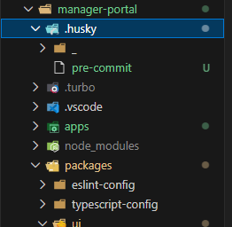

## 1. Turborepo 초기화

프로젝트명을 "manager-portal"로 지정하고, 패키지 매니저로 **pnpm** 선택한다.
**npx create-turbo@latest** 실행
```bash
linebird@localhost:~/workspace/arom_ktc$ npx create-turbo@latest
? Where would you like to create your Turborepo? manager-portal
? Which package manager do you want to use? pnpm

>>> Creating a new Turborepo with:

Application packages
 - apps/docs
 - apps/web
Library packages
 - packages/eslint-config
 - packages/typescript-config
 - packages/ui

>>> Success! Created your Turborepo at manager-portal

To get started:
- Change to the directory: cd manager-portal
- Enable Remote Caching (recommended): pnpm dlx turbo login
   - Learn more: https://turborepo.com/remote-cache

- Run commands with Turborepo:
   - pnpm run build: Build all apps and packages
   - pnpm run dev: Develop all apps and packages
   - pnpm run lint: Lint all apps and packages
- Run a command twice to hit cache
```

📁 생성 디렉토리 구조
```bash
manager-portal/
├── apps/
│   ├── docs/                 # 기본 생성 docs
│   └── web/                  # 기본 생성 web
├── packages/
│   ├── ui/                   # 기본 생성 ui
│   ├── typescrtipt-config/   # 기본 TypeScript
│   └── eslint-config/        # 기본 eslint
├── turbo.json                # Turborepo 설정 파일
├── package.json              # 루트 패키지 파일
├── tsconfig.json             # 루트 tsconfig
└── .npmrc
└── .gitignore
└── pnpm-lock.yaml
└── pnpm-workspace.yaml
└── README.md
```

## 2. Volta로 버전 관리

Volta는 nvm처럼 node 버전을 관리할 수 있는 Javascript Tool Manager이다  
**global package의 버전을 프로젝트에 따라 다르게 관리할 수 있다**  
Rust로 만들어져 있어 굉장히 빠르고 Windows, Linux, MacOS 를 지원한다  

[특징]
- 속도
- 원활한 프로젝트별 버전 전환
- Windows 및 모든 Unix 셸을 포함한 크로스 플랫폼 지원
- 다양한 패키지 관리자 지원
- 안정적인 도구 설치 - 노드 업그레이드 시마다 다시 설치할 필요가 없음
- 사이트별 사용자 정의를 위한 확장성 후크

### Volta 적용
volta를 적용할 프로젝트의 package.json에 아래처럼 volta를 키로하여 사용할 버전들을 추가해주면 된다. node, npm, yarn 버전 모두 명시가 가능하다.

#### 1) 기본 버전으로 volta 버전 추가
```json
  "volta": {
    "node": "20.5.1",
    "npm": "9.8.1",
    "pnpm": "9.0.0"
  }
```
shell에서 버전 확인
```bash
linebird@localhost:~/workspace/arom_ktc/manager-portal$ node -v
v20.5.1
linebird@localhost:~/workspace/arom_ktc/manager-portal$ npm -v
9.8.1
linebird@localhost:~/workspace/arom_ktc/manager-portal$ pnpm -v
9.0.0
```

#### 2) 다른 버전으로 volta 버전 변경
```json
  "volta": {
    "node": "22.17.1",
    "npm": "10.9.2",
    "pnpm": "10.9.0"
  }
```
shell에서 버전 확인
```bash
linebird@localhost:~/workspace/arom_ktc/manager-portal$ node -v
v22.17.1
linebird@localhost:~/workspace/arom_ktc/manager-portal$ npm -v
10.9.2
linebird@localhost:~/workspace/arom_ktc/manager-portal$ pnpm -v
9.0.0
```
pnpm의 버전이 변경되지 않았다. volta pin 명령 수행
```bash
linebird@localhost:~/workspace/arom_ktc/manager-portal$ volta pin pnpm@10.9.0
error: Only node and yarn can be pinned in a project

Use `npm install` or `yarn add` to select a version of pnpm for this project.
```
에러가 발생하는 원인은
- volta pin 명령어는 해당 프로젝트 디렉토리에 있을 때 사용해야 하는 특정 **Node.js 및 Yarn 버전을 설정**하도록 설계됨
- **pnpm** 패키지 관리자는 프로젝트별 버전을 설정하는 volta pin 명령에서 직접 지원되지 않는다

AI의 해결 방법 제시(gemini)
> npm이나 Yarn을 사용하여 개발 종속성이나 일반 종속성으로 설치해야 함

1. yarn을 사용하여 pnpm install
   ```bash
   yarn add -D pnpm@10.9.0
   ```
2. npm을 사용하여 pnpm install
   ```bash
   npm install --save-dev pnpm@10.9.0
   ```

> 2번을 수행했으나 에러 발생
```bash
linebird@localhost:~/workspace/arom_ktc/manager-portal$ npm install --save-dev pnpm@10.9.0
npm error Cannot read properties of null (reading 'matches')
npm error A complete log of this run can be found in: /home/linebird/.npm/_logs/2025-12-08T02_10_48_076Z-debug-0.log
```

#### 3) pnpm 버전 변경 error 해결
프로젝트의 package.json에서 packageManager의 버전을 수정하여 해결

```json
  "packageManager": "pnpm@10.9.0", <--- 이 부분 수정
  "engines": {
    "node": ">=18"
  },
  "volta": {
    "node": "22.17.1",
    "npm": "10.9.2",
    "pnpm": "10.9.0"
  }
}
```
shell 결과
```bash
linebird@localhost:~/workspace/arom_ktc/manager-portal$ pnpm -v
10.9.0
```

## 3. manager-console next app 생성

새로운 manager-console app을 생성한다

1. 디렉토리 생성
2. 생성된 디렉토리로 이동
3. npx create-next-app . --ts --eslint --tailwind --app --src-dir 실행 

실제 실행 예:
```bash
linebird@localhost:~/workspace/arom_ktc/manager-portal/apps$ mkdir manager-console
linebird@localhost:~/workspace/arom_ktc/manager-portal/apps$ cd manager-console/
linebird@localhost:~/workspace/arom_ktc/manager-portal/apps/manager-console$ npx create-next-app . --ts --eslint --tailwind --app --src-dir
✔ Would you like to use React Compiler? … No / Yes
✔ Would you like to customize the import alias (`@/*` by default)? … No / Yes
✔ What import alias would you like configured? … @/*
Creating a new Next.js app in /home/linebird/workspace/arom_ktc/manager-portal/apps/manager-console.

Using npm.

Initializing project with template: app-tw 


Installing dependencies:
- next
- react
- react-dom

Installing devDependencies:
- @tailwindcss/postcss
- @types/node
- @types/react
- @types/react-dom
- babel-plugin-react-compiler
- eslint
- eslint-config-next
- tailwindcss
- typescript


added 359 packages, and audited 360 packages in 23s

142 packages are looking for funding
  run `npm fund` for details

found 0 vulnerabilities

Generating route types...
✓ Types generated successfully

Success! Created manager-console at /home/linebird/workspace/arom_ktc/manager-portal/apps/manager-console
```

빌드
```bash
linebird@localhost:~/workspace/arom_ktc/manager-portal/apps/manager-console$ turbo run build
turbo 2.6.3

 WARNING  Unable to calculate transitive closures: Workspace 'apps/manager-console' not found in lockfile.
• Packages in scope: manager-console
• Running build in 1 packages
• Remote caching disabled
┌─ manager-console#build > cache miss, executing 654135e81c1e27d2 


> manager-console@0.1.0 build /home/linebird/workspace/arom_ktc/manager-portal/apps/manager-console
> next build

 ⚠ Warning: Next.js inferred your workspace root, but it may not be correct.
 We detected multiple lockfiles and selected the directory of /home/linebird/workspace/arom_ktc/manager-portal/pnpm-lock.yaml as the root directory.
 To silence this warning, set `turbopack.root` in your Next.js config, or consider removing one of the lockfiles if it's not needed.
   See https://nextjs.org/docs/app/api-reference/config/next-config-js/turbopack#root-directory for more information.
 Detected additional lockfiles: 
   * /home/linebird/workspace/arom_ktc/manager-portal/apps/manager-console/package-lock.json

   ▲ Next.js 16.0.7 (Turbopack)

   Creating an optimized production build ...
 ✓ Compiled successfully in 2.7s
 ✓ Finished TypeScript in 1907.8ms    
 ✓ Collecting page data using 11 workers in 381.2ms    
 ✓ Generating static pages using 11 workers (4/4) in 457.5ms
 ✓ Finalizing page optimization in 9.8ms    

Route (app)
┌ ○ /
└ ○ /_not-found


○  (Static)  prerendered as static content
└─ manager-console#build ──

 Tasks:    1 successful, 1 total
Cached:    0 cached, 1 total
  Time:    7.214s
```

2번째 build
```bash
linebird@localhost:~/workspace/arom_ktc/manager-portal/apps/manager-console$ turbo run build
turbo 2.6.3

 WARNING  Unable to calculate transitive closures: Workspace 'apps/manager-console' not found in lockfile.
• Packages in scope: manager-console
• Running build in 1 packages
• Remote caching disabled
┌─ manager-console#build > cache hit, replaying logs 654135e81c1e27d2 


> manager-console@0.1.0 build /home/linebird/workspace/arom_ktc/manager-portal/apps/manager-console
> next build

 ⚠ Warning: Next.js inferred your workspace root, but it may not be correct.
 We detected multiple lockfiles and selected the directory of /home/linebird/workspace/arom_ktc/manager-portal/pnpm-lock.yaml as the root directory.
 To silence this warning, set `turbopack.root` in your Next.js config, or consider removing one of the lockfiles if it's not needed.
   See https://nextjs.org/docs/app/api-reference/config/next-config-js/turbopack#root-directory for more information.
 Detected additional lockfiles: 
   * /home/linebird/workspace/arom_ktc/manager-portal/apps/manager-console/package-lock.json

   ▲ Next.js 16.0.7 (Turbopack)

   Creating an optimized production build ...
 ✓ Compiled successfully in 2.7s
 ✓ Finished TypeScript in 1907.8ms    
 ✓ Collecting page data using 11 workers in 381.2ms    
 ✓ Generating static pages using 11 workers (4/4) in 457.5ms
 ✓ Finalizing page optimization in 9.8ms    

Route (app)
┌ ○ /
└ ○ /_not-found


○  (Static)  prerendered as static content
└─ manager-console#build ──

 Tasks:    1 successful, 1 total
Cached:    1 cached, 1 total
  Time:    108ms >>> FULL TURBO
```
두번째 빌드는 cache를 사용해서 수행되어 108ms 시간 걸림


## 4. env-cmd를 활용한 환경변수 관리

1. 패키지 설치
   ```bash
   pnpm add env-cmd
   ```
2. 환경별 파일 생성
   .env.[NODE_DEV] 파일 생성
   1. .env.development 파일 생성
   2. .env.production 파일 생성
3. 스크립트 수정
   ```bash
   "scripts": {
        "dev": "next dev -p 3000 --turbo",
        "build": "next build",
        "start:development": "env-cmd -f .env.development next start",
        "start:production": "env-cmd -f .env.production next start",
        "build:development": "env-cmd -f .env.development next build",
        "build:production": "env-cmd -f .env.production next build",
        "lint": "next lint"
   },
   ```

## 4. package install 참고

> Radix UI만 packages/ui에서 사용
> 기타 대부분은 manager-console에서 사용

### 상태 관리 & 데이터 페칭

- **TanStack Query v5** - 서버 상태 관리
- **Zustand v5** - 클라이언트 상태 관리
- **Axios 1.8** - HTTP 클라이언트
> pnpm add @tanstack/react-query @tanstack/react-query-devtools @tanstack/react-table
> zustand axios


### UI & 스타일링

- **Tailwind CSS v4** - 유틸리티 퍼스트 CSS
- **Radix UI** - 헤드리스 컴포넌트                          <-- ../../ui 에서 사용됨
- **@kt-cloud-front/ui-react** - KT Cloud 디자인 시스템    <-- 현재 권한 없음(방화벽 확인 요청한 상태)
- **AG Grid** - 엔터프라이즈급 데이터 그리드

> pnpm add ag-grid-react ag-grid-community  
> pnpm add tailwindcss -D


### 폼 & 검증

- **React Hook Form 7.55** - 폼 상태 관리
- **Zod 3.24** - 스키마 검증

> pnpm add react-hook-form zod

### 테스팅

- **Jest** - 단위 테스트
- **Testing Library** - 컴포넌트 테스트
- **Storybook 9** - 컴포넌트 개발 환경    <-- 적용해야 할 지 검토
- **Playwright** - E2E 테스트            <--  적용해야 할 지 검토
- **MSW 2** - API 모킹

> pnpm add jest msw ...

### 기타

#### Husky와 lint-staged로 Git Hooks 자동화

##### Husky
Husky는 Git의 특정 이벤트(commit, add, push) 전후로 특정 hook을 동작할 수 있도록 하는 도구로 특정 상황에서 자동화를 통해 실행의 강제성을 부여하도록 한다.  
예를들어, commit된 코드는 무조건 formatting되어야 하고 push된 코드는 무조건 eslint가 pass되어야 한다는 규칙을 자동화로 구현할 수 있다.  
이러한 자동화를 Git Hook을 직접 설정하기에는 까다로우나 이를 간편하게 해결할 수 있는 도구가 Husky이다.

1. husky install
   ```bash
   pnpm add --save-dev husky
   ```
   에러 발생:
   ```bash
   ERR_PNPM_ADDING_TO_ROOT  Running this command will add the dependency to the workspace root, which might not be what you want - if you really meant it, make it explicit by running this command again with the -w flag (or --workspace-root). If you don't want to see this warning anymore, you may set the ignore-workspace-root-check setting to true.
   ``` 
   에러 원인 및 해결방법:
   > ERR_PNPM_ADDING_TO_ROOT는 pnpm 작업 공간 내에서 종속성을 추가하는 방법에 대한 pnpm의 경고이다. 이를 해결하기 위해서는
   1. 작업 공간 루트에 추가(의도된 동작) : **-w** 또는 **--workspace-root** 플레그를 추가한다
      ```bash
      pnpm add --save-dev husky -w
      ```
   2. 특정 패키지에 추가(표준 동작)
      ```bash
      cd manager-console
      pnpm add --save-dev husky
      ```
   3. 경고 비활성화(권장하지 않음)
      ```bash
      # In a file like .npmrc
      ignore-workspace-root-check=true
      ```
    > 우리의 project에서는 의도적으로 root에 종속성을 추가한다(1번 방법).
2. husky init
   ```bash
   pnpm exec husky init
   ```
   아래와 같은 .husky 디렉토리가 생성된다.   
     
   아래와 같이 pakage.json의 scripts에 prepare가 추가된다.
    ```json
      "scripts": {
        "build": "turbo run build",
        "dev": "turbo run dev",
        "lint": "turbo run lint",
        "format": "prettier --write \"**/*.{ts,tsx,md}\"",
        "check-types": "turbo run check-types",
        "prepare": "husky install"
      },
    ```
3. pre-commit hook과 commit-msg hook 추가(기존 프로젝트 copy) 
   - pre-commit
      ```bash
      #!/usr/bin/env sh
      . "$(dirname "$0")/_/husky.sh"

      ## git stage 파일 대상으로 eslint, prettier 검사
      echo "🔥lint-staged 진행"
      npx lint-staged
      echo "✅ lint-staged 성공"

      echo "✅ Pre-commit completed"
      ```
   - commit-msg
      ```bash
      #!/usr/bin/env sh
      . "$(dirname "$0")/_/husky.sh"

      echo "🔥commit-msg lint 진행"
      npx --no-install commitlint --edit "$1"
      echo "✅ commit-msg lint 성공"
      ```

##### lint-staged

lint-staged란 linter가 오직 stage 상태의 파일에만 적용될 수 있도록 도와주는 Node.js 패키지

1. install lint-staged
   ```bash
   pnpm add --save-dev lint-staged -w
   ```
2. package.json에 원하는 스크립트를 추가(기존 프로젝트 copy)
   ```json
   "lint-staged": {
     "**/*.{tsx,ts,jsx,js}": [
       "eslint --cache --fix",
       "prettier --cache --write"
     ]
   }, 
   ```
3. husky에서 lint-staged를 실행하도록, pre-commit, commit-msg 파일을 수정
4. git add 후 staged된 상태의 파일에만 린트를 실행하는지 확인


#### 기타 packages
- sonner, jose, jsencrypt, clsx, lucide-react ...

## 📚 참고 문서

- [Tuborepo 문서](https://turborepo.com/docs)
- [Next.js 문서](https://nextjs.org/docs)
- [pnpm 문서](https://pnpm.io/ko/motivation)
- [Volta 가이드](https://docs.volta.sh/guide/)
- [env-cmd 문서](https://github.com/toddbluhm/env-cmd#readme)
- [husky 공식 문서](https://typicode.github.io/husky/)
- [lint-staged 공식 문서](https://github.com/lint-staged/lint-staged)
